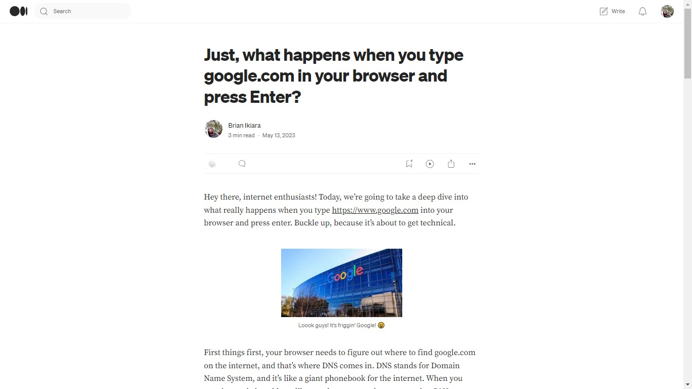

## 😊 Hello there...

This was my first ever post on [Medium](https://medium.com). I try to explain the whole process that's involved when we type in an URL in a browser, in a fun and simple manner. Yeah.

    

## 😁 Where can I view this article?

Click on 'Medium' to view it. You can create an account then follow me, ***that's if you want to***.
